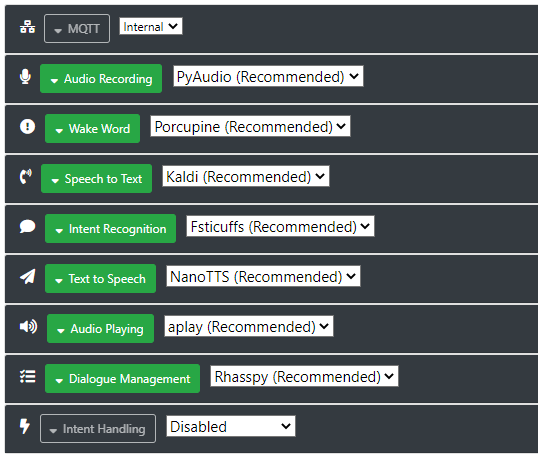
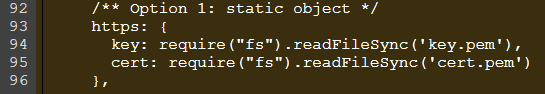

# OSSLab_Final_VoiceAssistent
Voice Assistent with Rhasspy and Node-Red

# What does this project do

# Why is this project useful

# How to get started

## Table of Contents
1. [General Info](#general-info)
2. [Use and future extentions](#Use-and-futur-extentions)
3. [Installation](#installation)
4. [Collaboration](#collaboration)
5. [FAQs](#faqs)

### General Info
***
This project contains a basic version of a voice assistent like it is known from commercial companies. Popular ones are Alexa (Amazon), Cortana (Microsoft), Google Assistant (Google) and Siri (Apple). All these voice assistants have in common that they need an internet connection to work. However, this also has disadvantages. Especially in terms of data security. Based on this motivation, this offline-capable voice assistant is created, which does not require an internet connection for the evaluation of the received commands.

The voice assistent can handle the following commands in this version:

To request the time:
- what time is it
- tell me the time

To request the date:
- what's the date today
- tell me the date

To request the outside temperature
- what's the temperature
- how (hot | cold) is it

## Use and future extentions
***
This project can be used to implement a voice assistent on a raspberry pi. This raspberry pi can be placed in any room where it is usefull to ask for several daily things, like the weather or the time. Futhermore the current implemented commands can be extended. As described, this is just a basic version, but since this groundwork is already done, it is convinient to extend the functionalities. For example: controlling the gpio-ports or switching the roomlight with voice-commands could be the next steps. However for performance reasons it is recomended to use at least a raspberry pi 3B+.

Because the equipment currently available has no microphone, this implementation is using a website which records the voice commands.

## How to get started

### Architecture and some backround

Voice Assistants consists of many individual parts. In the beginning an input is expected. In case of voice assistants this is an audio recording. In the end any output should be made. Between these two steps a lot of other things have to take place. This includes the following steps: Audio Recording, Wake Word, Speech to Text, Intent Recognition, Text to Speech, Audio Playing, Dialogue Management.
For all these steps in the last years a lot of open-source software has been developed. One of them is a voice assistant service called Rhasspy. With this it is possible to do all these steps offline on the raspberry pi. Rhasspy is installed via docker as a container, so it is easy to organize it. After this is done, the rhasspy-webpage can be reached via port 12101. (http://localhost:12101)

However, for some of these steps an additional software is required. Node-Red takes over the steps intent recognition and dialogue management. Rhasspy offers some convenient ways to communicate with other software. Those are MQTT, http-requests and websockets.
Node-Red is a programming tool which provides a browser-based editor. Within this editor you can create program flows by wiring together different nodes. Function nodes can be used to implement java-script code. This is reached via port 1880. (https://localhost:1880)
For the installlation of rhasspy and node-red, a shell-script named 'va_install' is provided. 


### Installation
***
Clone repository and install rhasspy and node-red via shell-script 'va_install'.

In addition the script puts rhasspy into the autostart mode
```
$ git clone https://github.com/lbuetgit/OSSLab_Final_VoiceAssistent.git
$ cd OSSLab_Final_VoiceAssistent
$ ./va_install
```
Install all node.js dependencies and reboot your raspberry pi
```
$ cd OSSLab_Final_VoiceAssistent/.node-red
$ npm install
$ sudo reboot
```
Start node-red
```
$ cd OSSLab_Final_VoiceAssistent/.node-red
$ node-red
```

## Settings
***
To use the voice assistent properly, some additional settings has to be made.

First, all the engines for the different tasks which rhasspy does, has to be choosen.
The following screenshot shows the settings which gave the best results.



Second, the sentences which we want the voice assistent to understand, have to be defined. Therefore, under the tab 'sentences', the following code has to be added.
```
[Get_Time]
what time is it
tell me the time

[Get_Date]
what's the date today
tell me the date

[GetTemperature]
what's the temperature
how (hot | cold) is it
```

Third. To get permission from the browser to use the microphone, a https-protocoll is nedded.
This has to be changed in the settings.js-file, which is placed under the home directory.

This screenshot shows the changes which have to be made. This will enable the https-protocoll.



### Documentation
***
To get more information about rhasspy and node-red, use this links. Both have a verry handy and organized documentation which describes a lot of problems and how to get started.
* [Rhasspy](https://rhasspy.readthedocs.io/en/latest/)
* [Node-Red](https://nodered.org/)

| Headline 1 in the tablehead | Headline 2 in the tablehead | Headline 3 in the tablehead |
|:--------------|:-------------:|--------------:|
| text-align left | text-align center | text-align right |
